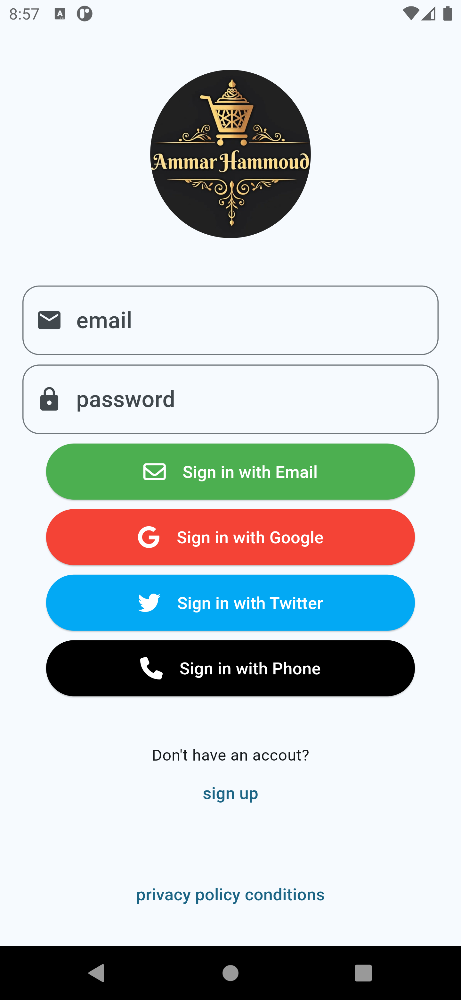
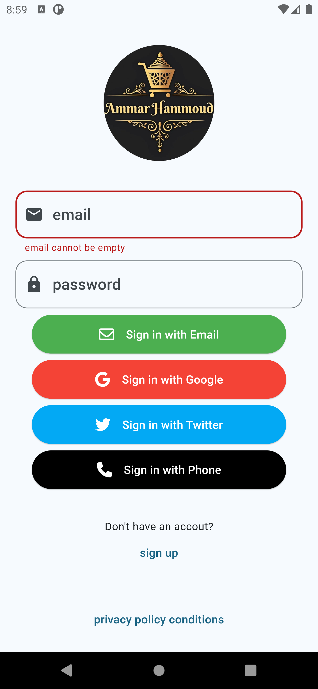
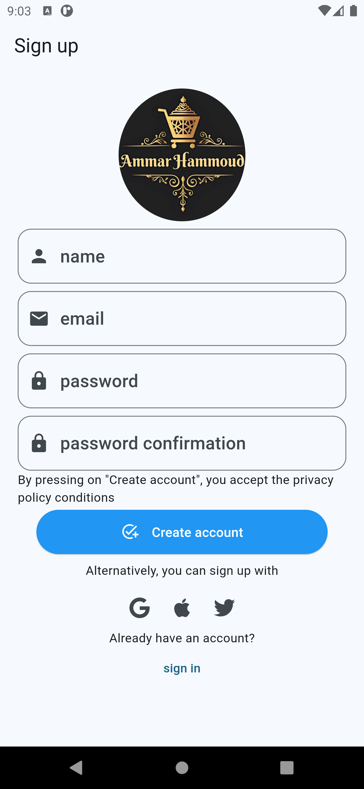
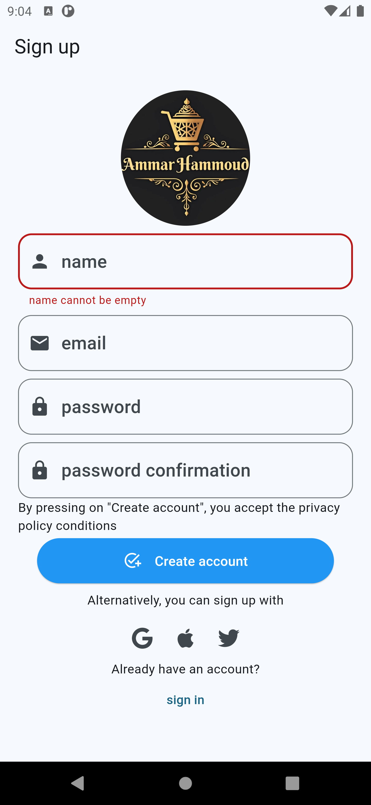
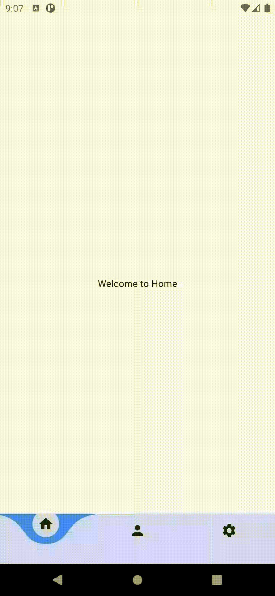

# prokoders Ecommerce App

A new Flutter project, several assigned tasks by Prokoders.

#### Task #1  
##### :date: start date: 23/10/2024 06:45 PM - Deadline: 24/10/2024 10:00 AM
Objective: Build and E-commerce app with onboarding screens and animate transitions. You are taksed with building an e-commerce application that includes an onboarding process with smooth animations between screens. The onboarding screen will showcase main features of the app, and the user will navigate through them before reaching the main shopping screen.  
Result:  
  
  
#### Task #2  
##### :date: start date: 25/10/2024 09:30 PM - Deadline: 27/10/2024 10:00 AM
Objective:  
* Login screen  
Create a login screen where the user can enter their credentials:  
    * Fields: Include input fields for `email` and `passowrd`.  
    * Button: Add a login button to submit the credentials.  
    * Link to sign up: Provide a link or button that allows users to navigate to the sign up screen if they don't have an account.  
Requirements:  
    * Validate the email and password fields to ensure valid input.  
    * Include basic error handling for missing or invalid input.  

| Login screen | Validated field |
| --- | --- |
|  |  |  

* Sign up screen:  
Design a sign-up screen for new users to create an account:  
    * fields: Add fields for `name`, `email`, `password`, and `passwordConfirmation`.  
    * Include a sign up button to submit the user's information.  
    * Link to login: Provide a link to navigate back to the login screen.  
Requirements:  
    * Validate all fields to ensure that required inputs are present.
    * Check that `password` and `passwordConfirmation` fields match.  

| Signup screen | Validated field |
| --- | --- |
|  |  |  

* Home screen with bottom navigation bar:  
After logging in, users should be directed to the home screen, which will have bottom navigation bar for easy access to different sections of the app.  
    * Bottom Navigation bar: Implement a bottom navigation bar with al least three sections (for example, Home, Profile, and Settings).  
    * Screen content: Each section should have placeholder text or simple content representing that section (e.g., "Welcom to Home", "User Profile", and "App Settings").  
Requirements:  
    * Implement smooth navigation between different sections when the user taps teh items in the bottom navigation bar.  
    * Ensure the bottom navigation bar is visible across all sections within the home screen.  
